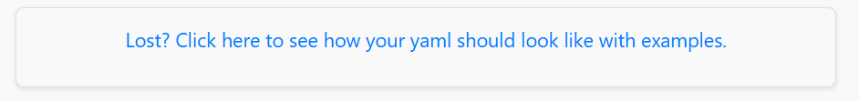
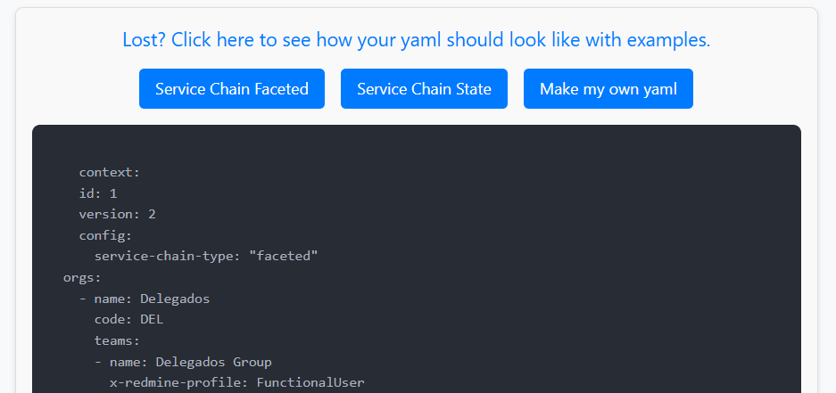

# Creating my service chain

import Disclaimer from '@site/src/components/Disclaimer.js';
import Alert from '@site/src/components/Alert.js';

In this section you will learn how to create your own service chains and where to find some examples.

You can see in *Import* and *Synchronization* views a component offering some help in case you are a bit lost.

  
**Figure 1:** *Import and synchronization helper.*

If you click there, you can see one service type faceted sample chain, one service type state sample chain, and a third option. You can see these chains and go to your service chain creation page by clicking in ***Make my own yaml*** option.

  
**Figure 2:** *Helper options.*

## Yaml editor

