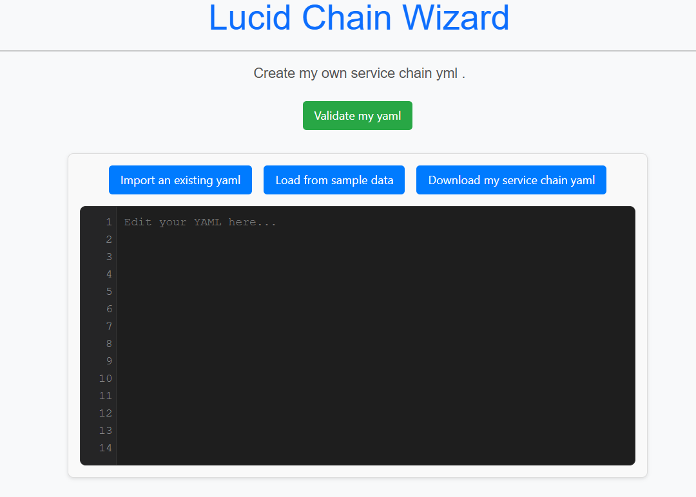
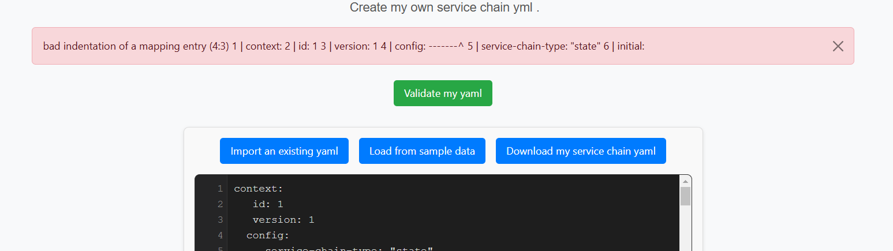
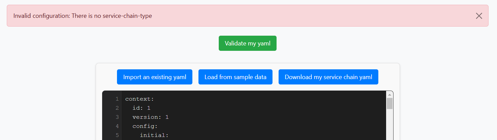
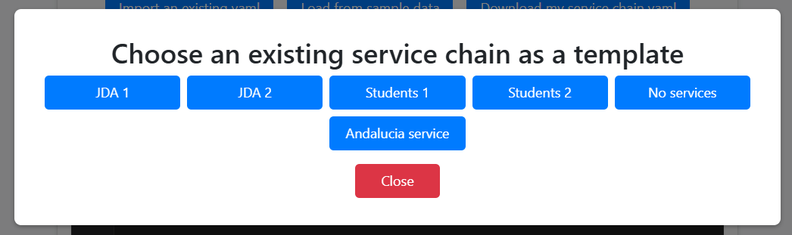
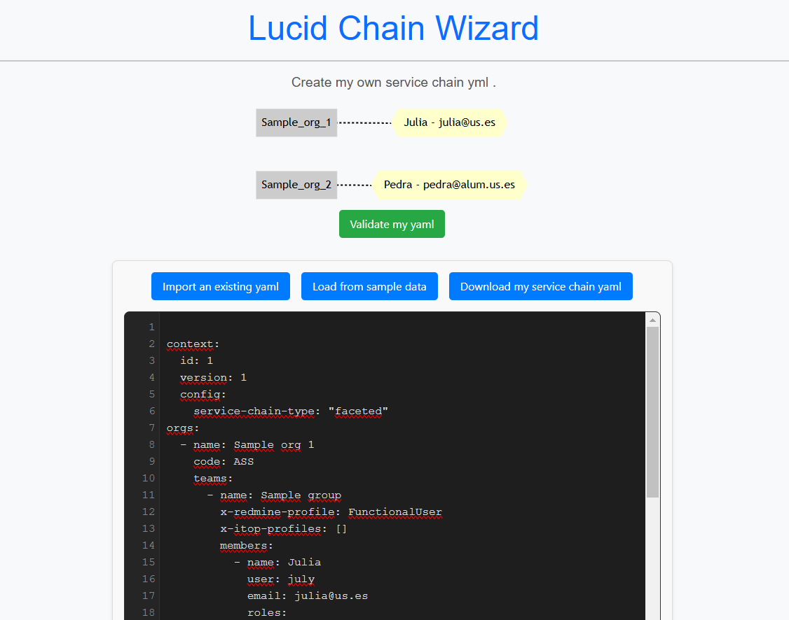

# Creating my service chain

import Disclaimer from '@site/src/components/Disclaimer.js';
import Alert from '@site/src/components/Alert.js';

In this section you will learn how to create your own service chains and where to find some examples.

You can see in *Import* and *Synchronization* views a component offering some help in case you are a bit lost.

  
**Figure 1:** *Import and synchronization helper.*

If you click there, you can see one service type faceted sample chain, one service type state sample chain, and a third option. You can see these chains and go to your service chain creation page by clicking in ***Make my own yaml*** option.

  
**Figure 2:** *Helper options.*

## Yaml editor

You will be redirected to a yaml editor page. Here you will see more blue buttons with options and a green button that says *validate my yaml*. You can write your sercive chain from scratch and using a template. This editor works as any IDE or file editing software but adding SCModel validations on the fly.

  
**Figure 3:** *Yaml editor.*

## Validate my yaml button

This green button analyses the yaml editor content following SCModel rules. If the service chain is valid, a mermaid diagram of it will be displayed.

<Alert>
If you see something in the mermaid graph like *"Max size exceeded"* do not panic. It is because your chain is too big to be represented in mermaid. We are very sorry for that but this is something we cannot fix because it is a mermaid limitation.
</Alert>

## Import an existing yaml button

When you click this button, you can import a yaml with a service chain and it will be displayed in the yaml editor. It will also be validated following SCModel notation. Once it is imported, you can edit it and click ***Validate my yaml*** for checking if it is well indented and follows SCModel. You can also see a mermaid diagram representation of your chain.

  
**Figure 4:** *Indentation errors.*

  
**Figure 5:** *SCModel validation errors.*

## Load from sample data button

This button is similar to the previous one. When you click it, you can select a sample chain yaml to be displayed and edited. You can also see its representation in mermaid.

  
**Figure 6:** *Sample service chain options.*

## Download my service chain yaml button

This option downloads whatever is in the yaml editor as a yaml file. It will be downloaded instantly in your ***"Downloads"*** folder and named ***service-chain.yaml***

  
**Figure 7:** *Custom service chain created with yaml editor.*

