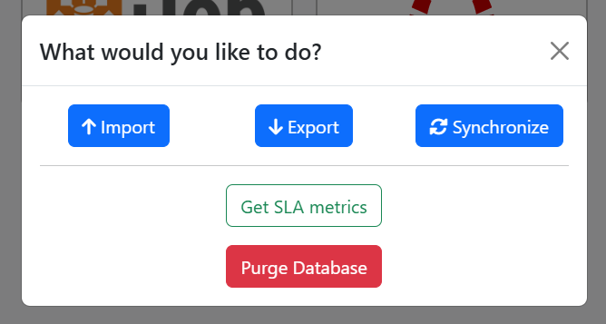
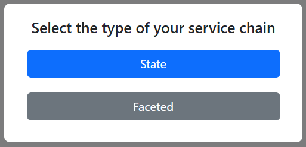
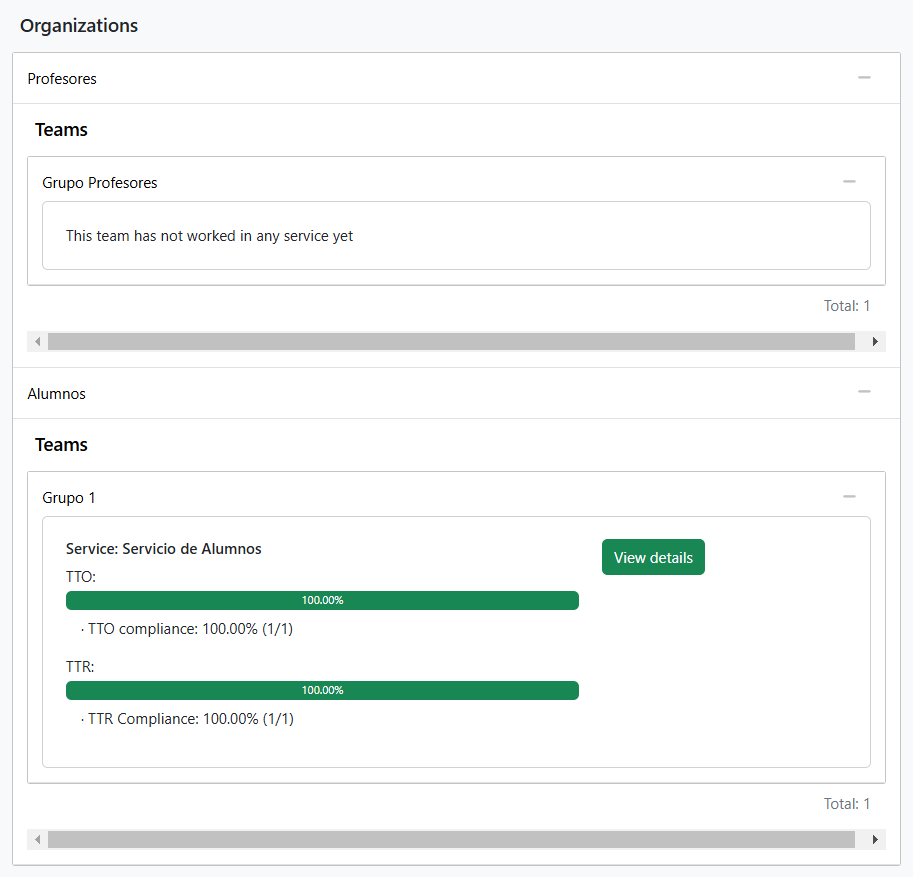
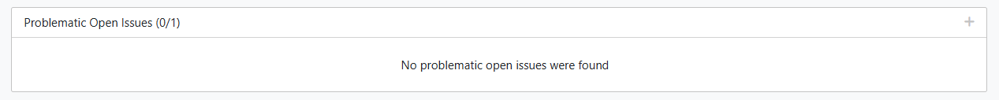

# Metrics

import Alert from '@site/src/components/Alert.js';
import Disclaimer from '@site/src/components/Disclaimer.js';

In this section you will learn about Lucid chain SLA metrics and how to interpret them.

<Alert>
Take into account that in ITop TTR is defined as the time between **issue creation** and **issue resolution**. This **differs** from Lucid chain TTR definition. It is also important to remember that ***ownership-type state+team is not supported in ITop*** because Itop does not allow to assign and issue to a group without assining it to a user at the same time. We are very sorry for that but nothing can be done as we cannot modify your ITop in order to do this.
</Alert>

## Choosing the target and selecting Metrics

If you want to analyse your SLA metrics of your current service chain in Redmine or Itop, you can do it by clicking on Redmine or ITop logo and selecting ***Get SLA Metrics*** option in the modal.

  
**Figure 1:** *Lucid Chain available features modal.*

## Global Overview

You will be redirected to global overview page. You will be asked about choosing your service chain type. This will make Lucid Chain export your current chain and showing it to you. You will be able to see your current chain represented in a mermaid grpah. You can toggle the mermaid and also zoom in by clicking on the graph. You can also see some import imformation about how many organizations, teams and service you are going to import.

  
**Figure 2:** *Service chain type modal.*

<Alert>
If you see something in the mermaid graph like ***"Max size exceeded"*** do not panic. It is because your chain is too big to be represented in mermaid. We are very sorry for that but this is something we cannot fix because it is a mermaid limitation.
</Alert>

### Organizations

In this view you will be able to see a lot of overall information. In addition of your service chain, which you can toggle, you will also see a component named Organizations.

It is a list of your service chain organizations. You can toggle each one by clicking in its name. This will display all the teams it has. You can also toggle them by clicking on them. If no data is retrieved, this means that there are no issues associated with that team. In other case, you will see a progress bar showing TTO and TTR passed percentage and how many issues from the total issues of this team are passing the SLA defined in your yaml.

<Disclaimer>
When we say that an issue has passed SLA, it means that this issue's TTO and TTR have valid values according to the service chain model described in the yaml and imported in your tool.
</Disclaimer>

  
**Figure 3:** *Basic example of organization component.*

### Problematic open issues

If you scroll down you will be able to see a rectagle that says ***Problematic open issues  (X/Y)***, where X is the total number of problematic open issues, and the Y is the total number of open issues. You can click on it in order to toggle it and see the table.Here you can see all the open issues whose TTOs and/or TTRs have been exceded. The ideal situation is an empty table (Figure 4).

  
**Figure 4:** *Ideal situation where there are not problematic open issues.*

:::tip
If you click in any issue, Lucid chain will redirect you exactly to the link of it in your ITop or Redmine in a new page in your browser.
:::

If any issues are shown, you will be able to see a lot of information about them. You will see some columns:

+ <u>***Issue:***</u> This column contains issue id, title, the person assigned to it, its type and its creation date.

+ <u>***TTO:***</u> This column contains the issue TTO. If TTO does not pass SLA, the exceding time will be shown below as *"+ X h"* in hours.

+ <u>***TTR:***</u> This column contains the issue TTR. If TTR does not pass SLA, the exceding time will be shown below as *"+ X h"* in hours.

+ <u>***TOTAL:***</u> This column contains the sum of issue TTO and TTR. If any of does not pass the SLA, exceding time will be shown below as *"+ Xh"* in hours.

+ <u>***STATE:***</u> This column shows the current state of the issue. This is very usefull for service chain type state because you can kwno the service associated with it instantly.

### SLA Passed Pie chart

### SLA Passed last 6 months Pie chart

## Global Details

## Service Details
