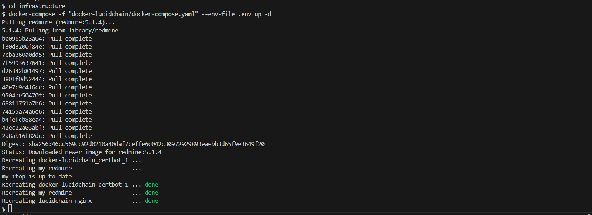

# Deployment

import Disclaimer from '@site/src/components/Disclaimer.js';
import Alert from '@site/src/components/Alert.js';

In this section you will learn how to deploy Lucid Chain wizard step by step.

## Alone deployment

If you want to deploy just Lucid Chain wizard because you already have Redmine or ITop available and deployed, you just have to run the following commands:

``` bin/bash
docker pull lucidchain/lucidchain_wizard:latest
docker run -d --name lucid-chain lucidchain/lucidchain_wizard:latest
```

This will pull Lucid Chain image and run a container named ***lucid-chain*** in your docker.

:::important
Take into account that you need to have ***your port 3000 available*** in order to make it work. Please make sure you use ***latest*** version because there are not other stable versions yet.
:::

## Deployment with ITop and Redmine in a nginx enviroment

In case you want to deploy Lucid Chain with ITop and Redmine at the same time, you can do it installing and deploying each tool separately or through Lucid Chain infrastructure.

<Alert>
You will need to have a ningx streamer in order to deploy like this. For now Kubernetes has not been tested or supported. We are sorry for that and we will try to include that in future versions.
</Alert>

In order to use Lucid Chain infrastructure, you have to follow these steps:

1. Clone infrastructure repository.

    ``` bin/bash
    git clone https://github.com/lucidchain/infrastructure
    cd infrastructure
    ```

2. If you are using nginx you can use docker-compose.yaml to directly deploy all structure. But first you will have to create a .env file with some configuration variables.

    ``` .env
    SERVICES_PREFIX=yourServicePrefix
    DNS_SUFFIX=yourDNSSuffix
    RM_DB_PASSWORD=yourRedmineDatabasePassword
    RM_SECRET_KEY_BASE=yourRedmineSecretKeyBase
    ```

3. Once you have your .env you can run the following command to run all the containers.

    ``` bin/bash
    docker-compose -f "docker-lucidchain/docker-compose.yaml" --env-file .env up -d
    ```

    <div align="center">
      
    **Figure 1:** *Deploy Lucid Chain with ITop and Redmine.*
    </div>

<Disclaimer>
Execute this command inside infrastructure directory and remember to have in that folder a .env file.
</Disclaimer>
